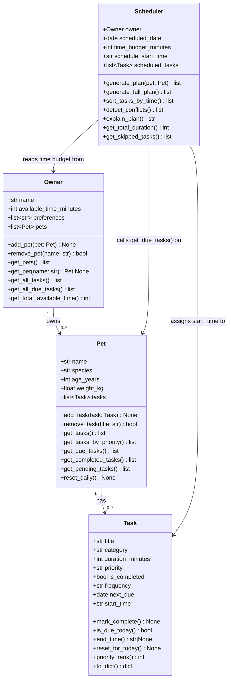

# PawPal+ Project Reflection

## 1. System Design

### Core User Actions

The three core actions a user should be able to perform in PawPal+:

1. **Add and manage a pet profile** — The user enters their pet's name, species, age, and weight. This gives the system a subject to schedule care for, and species/age can influence which task types are relevant (e.g., older dogs need shorter walks).

2. **Add care tasks with duration and priority** — The user creates tasks like "Morning walk (20 min, high)", "Feed dinner (5 min, high)", or "Brush coat (10 min, low)". Each task captures what needs to happen, how long it takes, how critical it is, and whether it recurs — the raw input the scheduler needs.

3. **Generate and view today's daily plan** — Given the owner's available time and the pet's task list, the user clicks a button and receives an ordered, time-stamped plan for the day along with conflict warnings, skipped-task explanations, and a plain-English justification.

### Mermaid.js Class Diagram — Final (Phase 6)

**Module-level helpers** (not classes): `sort_tasks_by_time(tasks)` and `filter_tasks(tasks, ...)` are standalone functions imported directly by `app.py` and used inside `Scheduler`.

**a. Initial design**

The design uses four classes:

- **Owner** — Holds the pet owner's identity and constraints (name, available time in minutes, preferences). Responsible for managing the list of pets and exposing total scheduling time to the Scheduler.
- **Pet** — Represents a single pet with basic profile info (name, species, age, weight). Owns a list of Task objects and can return them sorted by priority or filtered by due-date for the scheduler to consume.
- **Task** — A Python dataclass representing one care activity. Stores title, category (walk/feed/meds/grooming), duration, priority (low/medium/high), completion status, recurrence frequency, next_due date, and the wall-clock start_time assigned by the Scheduler. Responsible for marking itself done, advancing its due date, and serialising to a dict for display.
- **Scheduler** — The orchestration class. Takes an Owner and operates on a Pet's due-task list. `generate_plan()` greedily selects tasks in priority order, assigns HH:MM start times sequentially, and records skipped tasks. `detect_conflicts()` scans for overlapping time windows.

Key relationship: `Owner` has many `Pet`s; each `Pet` has many `Task`s; `Scheduler` receives an `Owner` (for time budget and day start) and a `Pet` (for due tasks) and produces a sorted, time-bounded, conflict-checked plan.

**b. Design changes**

One notable change from the first sketch: the initial design gave `Scheduler` a direct `pet` attribute set at construction time. After reviewing the skeleton, it was clearer that `generate_plan(pet)` should accept the pet as a parameter instead. This makes the `Scheduler` reusable across multiple pets belonging to the same owner without needing a new instance, which is a better fit for an owner who has more than one pet. The `owner` stays on the constructor because the time budget is truly an owner-level constraint that doesn't change per call.

A second change: `Task` was initially a plain class. Switching to a Python `@dataclass` eliminated boilerplate `__init__` and `__repr__` code. Later, three fields were added (`frequency`, `next_due`, `start_time`) without needing to touch `__init__` at all — a concrete benefit of the dataclass approach.

A third change driven by Phase 4: `generate_plan()` originally pulled tasks via `pet.get_tasks_by_priority()`. After adding recurrence, it was changed to call `pet.get_due_tasks()` first (which filters out tasks whose `next_due` is in the future) and then sort by priority. This kept recurrence logic inside `Task`/`Pet` where it belongs, and kept `Scheduler` as a pure consumer of already-filtered data.

---

## 2. Scheduling Logic and Tradeoffs

**a. Constraints and priorities**

The scheduler considers three constraints in order of importance:

1. **Recurrence / due date** — tasks that are not due today (because a recurring task was already completed and its `next_due` is in the future) are filtered out entirely before scheduling begins. This is the hardest constraint: no budget can override it.
2. **Time budget** — the owner's `available_time_minutes` caps the total duration of the day's plan. Tasks that would exceed the remaining time are skipped and recorded.
3. **Priority** — within the time budget, tasks are sorted high → medium → low so the most important care always fits first. Priority was chosen as the primary scheduling key (over, say, duration) because pet health tasks like medication or feeding should always be attempted before enrichment activities regardless of how long they take.

**b. Tradeoffs**

**Tradeoff: greedy priority-first vs. optimal packing.**

The scheduler uses a greedy algorithm: it works through tasks in priority order and takes each one as long as it fits. This can leave wasted time. For example, with a 10-minute budget, a high-priority 9-minute task is taken and the remaining 1 minute can't fit the next task — even though a different combination might have packed the budget more completely.

A knapsack-style optimal algorithm could pack the budget more tightly, but it is O(n × budget) in time and space versus O(n log n) for the greedy sort. For a pet owner with at most ~10–20 tasks per day, this is not a performance concern — but the greedy approach is far easier to explain, debug, and extend, which matters more in a prototype tool. The correctness guarantee we do provide (every high-priority task is attempted before any lower-priority task) is the one that matters most for pet health.

A second tradeoff: **conflict detection is advisory, not preventive.** The greedy scheduler never produces conflicts by construction (it assigns times sequentially). `detect_conflicts()` is most useful when tasks arrive with pre-set times from an external source. Choosing to warn rather than block lets the owner decide whether a conflict is real (two pets at the vet simultaneously) or harmless (two brief tasks that could actually overlap).

---

## 3. AI Collaboration

**a. How you used AI**

AI (Claude) was used in three distinct modes across this project:

- **Design brainstorming (Phase 1):** AI helped translate a rough description of the four classes into a Mermaid.js UML diagram and suggested using Python dataclasses for `Task` and `Pet`. The most useful prompt pattern was: *"Given these four classes and their responsibilities, what relationships should exist between them?"* — because it forced the AI to reason about the data model rather than just produce code.

- **Skeleton-to-implementation (Phases 2–3):** AI generated method bodies from docstrings. The most productive approach was providing a clear docstring first, then asking the AI to implement it, rather than asking the AI to design and implement simultaneously. This kept the human as the architect.

- **Edge-case discovery (Phase 5):** AI was asked *"What are the most important edge cases to test for a pet scheduler with sorting and recurring tasks?"* The suggestions (exact-fit budget, all-recurring-done empty plan, three-way conflict, stable sort) were more comprehensive than what a first pass would have identified manually.

The most consistently helpful prompt structure was: **describe the constraint or invariant first, then ask for code that satisfies it.** Generic prompts like "write a scheduler" produced bloated, unusable output; specific prompts like "implement a greedy algorithm that picks tasks in priority order and stops when the time budget is exhausted" produced exactly the right level of code.

**b. Judgment and verification**

The clearest moment of rejection: when the AI initially suggested making `detect_conflicts()` raise an exception when it found an overlap. The suggestion was to treat conflicts as errors — halt the program and force the user to fix them before a plan could be generated. This was rejected because:

1. A pet owner using a web app should receive a *warning*, not a crash.
2. The greedy scheduler itself never produces conflicts, so an exception in `detect_conflicts()` would only ever fire if the method was called on manually-time-stamped external tasks — a narrow edge case that doesn't warrant halting the entire scheduling workflow.

The accepted design returns a list of warning strings (empty = clean) and lets `explain_plan()` surface them inline. This was verified by writing two tests: one that checks the warning count for overlapping tasks, and one that confirms the greedy plan always produces an empty conflict list.

---

## 4. Testing and Verification

**a. What you tested**

The suite covers 72 tests across 9 classes:

| Behavior | Why it mattered |
|---|---|
| `mark_complete()` flips `is_completed` | Core state mutation — everything downstream depends on it |
| Priority ranking: high > medium > low | Determines scheduling order; a bug here would silently swap important and trivial tasks |
| Greedy plan stays within time budget | The primary correctness guarantee of the scheduler |
| High-priority tasks appear before low in plan | Validates the sort key, not just the budget constraint |
| Daily task advances `next_due` by 1 day | Verifies timedelta arithmetic; off-by-one would break the entire recurrence system |
| Completed recurring task excluded from next plan | Proves `is_due_today()` integrates correctly with `generate_plan()` |
| Overlapping tasks produce conflict warnings | Validates the interval-overlap formula `a_start < b_end and b_start < a_end` |
| Greedy plan is always conflict-free | Proves the sequential start-time assignment is correct |
| `filter_tasks()` does not mutate the input list | Safety property — callers must be able to filter without side effects |
| Two pets with same task title are independent | Guards against accidental shared state between pet objects |

**b. Confidence**

**★★★★☆ — 4 out of 5.**

The core scheduling behaviours are thoroughly covered. Confidence is high that the logic layer (`pawpal_system.py`) is correct for all tested scenarios. Two gaps remain:

1. **UI integration is untested** — `app.py` is not exercised by any test. A bug in how session state is written or read would not be caught.
2. **Multi-day recurrence sequences** — the tests verify that `next_due` is set correctly after one completion, but do not simulate rolling the date forward to verify that the task re-enters the plan correctly the next day. That would require mocking `date.today()`.

If more time were available, the next tests would be: (1) a parametrized test that mocks `date.today()` to simulate a week of recurring task completions, and (2) a Streamlit testing-library integration test for the "Generate schedule" button flow.

---

## 5. Reflection

**a. What went well**

The part of this project most worth being satisfied with is the **layered architecture**: the logic layer (`pawpal_system.py`) is completely independent of the UI layer (`app.py`). Every feature — recurrence, sorting, conflict detection, filtering — was built and verified in the terminal via `main.py` and the test suite before a single Streamlit component was written. This meant that when bugs appeared in the UI, the search space was always "how is the UI calling the logic wrong?" rather than "is the logic itself broken?" — a much easier debugging problem.

The 72-test suite gives real confidence that each piece of the system does what it claims. Writing edge-case tests (exact-fit budget, all-recurring-done empty plan) also surfaced two subtle bugs during development: the Scheduler was not clearing `start_time` on skipped tasks, and `generate_plan()` was not replacing `_skipped_tasks` on a second call. Both were caught by tests before reaching the UI.

**b. What you would improve**

If there were another iteration, the top two improvements would be:

1. **Persist state across sessions** — currently the entire Owner/Pet/Task graph lives in `st.session_state` and disappears when the browser tab closes. Adding a JSON serialisation layer (save to a local file or browser `localStorage`) would make the app genuinely useful day-to-day rather than as a demo.

2. **Smarter scheduling: fill gaps after the greedy pass** — the greedy algorithm can leave unused minutes at the end of the budget. A second pass that checks whether any skipped low-priority tasks fit in the remaining time would improve utilisation without abandoning the priority-first guarantee.

**c. Key takeaway**

The most important insight from this project about designing systems with AI is: **AI is an excellent implementer but a poor architect.** When given a clear specification — a class name, a docstring, a list of invariants — the AI produces correct, idiomatic code quickly. When asked open-ended questions ("design me a scheduler"), it produces plausible-looking but architecturally shallow code that satisfies the surface requirement while missing important properties (testability, separation of concerns, recoverability from bad input).

The lead architect's job is not to write every line, but to own every decision: what classes exist, what invariants they guarantee, what the public API surface is, and what the tests must prove. AI accelerates the filling-in work between those decisions. The moment the architect hands those decisions to the AI — "just build me something that works" — the resulting system is harder to understand, harder to test, and harder to extend.
