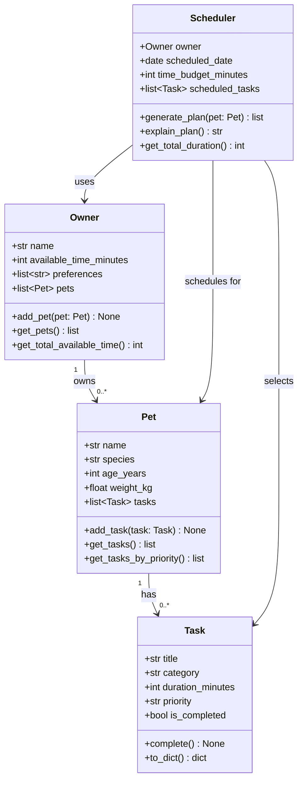

# PawPal+ Project Reflection

## 1. System Design

### Core User Actions

The three core actions a user should be able to perform in PawPal+:

1. **Add and manage a pet profile** — The user enters their pet's name, species, age, and weight. This gives the system a subject to schedule care for, and species/age can influence which task types are relevant (e.g., older dogs need shorter walks).

2. **Add care tasks with duration and priority** — The user creates tasks like "Morning walk (20 min, high)", "Feed dinner (5 min, high)", or "Brush coat (10 min, low)". Each task captures what needs to happen, how long it takes, and how critical it is — the raw input the scheduler needs.

3. **Generate and view today's daily plan** — Given the owner's available time and the pet's task list, the user clicks a button and receives an ordered, time-aware plan for the day along with a plain-English explanation of why each task was included or excluded.

### Mermaid.js Class Diagram

**a. Initial design**

The design uses four classes:

- **Owner** — Holds the pet owner's identity and constraints (name, available time in minutes, preferences like "prefer morning tasks"). Responsible for managing the list of pets and exposing total scheduling time to the Scheduler.
- **Pet** — Represents a single pet with basic profile info (name, species, age, weight). Owns a list of Task objects and can return them sorted by priority for the scheduler to consume.
- **Task** — A Python dataclass representing one care activity. Stores title, category (walk/feed/meds/grooming), duration, priority (low/medium/high), and completion status. Responsible for marking itself done and serializing to a dict for display.
- **Scheduler** — The orchestration class. Takes an Owner and operates on a specific Pet's task list. `generate_plan()` greedily selects tasks in priority order until the time budget is exhausted. `explain_plan()` returns a human-readable justification string.

Key relationship: `Owner` has many `Pet`s; each `Pet` has many `Task`s; `Scheduler` receives an `Owner` (for time budget) and a `Pet` (for tasks) and produces a sorted, time-bounded plan.

**b. Design changes**

One notable change from the first sketch: the initial design gave `Scheduler` a direct `pet` attribute set at construction time. After reviewing the skeleton, it was clearer that `generate_plan(pet)` should accept the pet as a parameter instead. This makes the `Scheduler` reusable across multiple pets belonging to the same owner without needing a new instance, which is a better fit for an owner who has more than one pet. The `owner` stays on the constructor because the time budget is truly an owner-level constraint that doesn't change per call.

A second small change: `Task` was initially a plain class. Switching to a Python `@dataclass` eliminated boilerplate `__init__` and `__repr__` code and made the intent (a simple value-holding object) clearer — exactly what Copilot / AI review recommended.

---

## 2. Scheduling Logic and Tradeoffs

**a. Constraints and priorities**

The scheduler considers three constraints in order of importance:

1. **Recurrence / due date** — tasks that are not due today (because a recurring task was already completed and its `next_due` is in the future) are filtered out entirely before scheduling begins. This is the hardest constraint: no budget can override it.
2. **Time budget** — the owner's `available_time_minutes` caps the total duration of the day's plan. Tasks that would exceed the remaining time are skipped and recorded.
3. **Priority** — within the time budget, tasks are sorted high → medium → low so the most important care always fits first. Priority was chosen as the primary scheduling key (over, say, duration) because pet health tasks like medication or feeding should always be attempted before enrichment activities regardless of how long they take.

**b. Tradeoffs**

**Tradeoff: greedy priority-first vs. optimal packing.**

The scheduler uses a greedy algorithm: it works through tasks in priority order and takes each one as long as it fits. This can leave wasted time. For example, if the budget is 10 minutes, a high-priority 9-minute task is taken, and then a low-priority 1-minute task cannot fit after a 10-minute medium-priority task that would have used the budget perfectly — but the greedy algorithm already committed to the high-priority task.

A knapsack-style optimal algorithm could pack the budget more tightly, but it is O(n × budget) in time and space versus O(n log n) for the greedy sort. For a pet owner with at most ~10–20 tasks per day, this is not a performance concern — but the greedy approach is far easier to explain, debug, and extend, which matters more in a prototype tool used by a single owner. The correctness guarantee we do provide (every high-priority task is attempted before any lower-priority task) is the one that matters most for pet health.

---

## 3. AI Collaboration

**a. How you used AI**

- How did you use AI tools during this project (for example: design brainstorming, debugging, refactoring)?
- What kinds of prompts or questions were most helpful?

**b. Judgment and verification**

- Describe one moment where you did not accept an AI suggestion as-is.
- How did you evaluate or verify what the AI suggested?

---

## 4. Testing and Verification

**a. What you tested**

- What behaviors did you test?
- Why were these tests important?

**b. Confidence**

- How confident are you that your scheduler works correctly?
- What edge cases would you test next if you had more time?

---

## 5. Reflection

**a. What went well**

- What part of this project are you most satisfied with?

**b. What you would improve**

- If you had another iteration, what would you improve or redesign?

**c. Key takeaway**

- What is one important thing you learned about designing systems or working with AI on this project?
